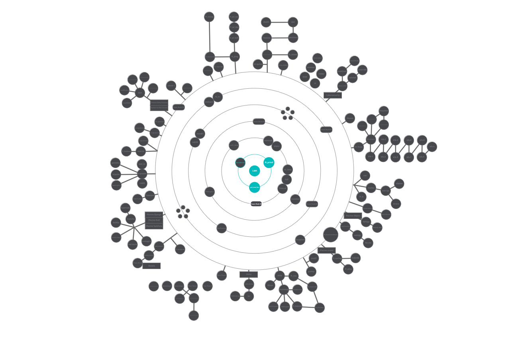

  
  

  
  

<h1 align="center" style="border: none;">
  42 Projects
</h1>

  <b><i>Repository of projects developed in Common Core - Training</i></b>

<h2 style="text-align: center;border: none;">Minha Jornada na 42 📖</h2>

Este repositório tem o intuito de reunir minha trajetória pela 42, apresentando os projetos, desafios, e experiências ao longo da minha jornada no <strong>Core Curriculum</strong>.

<h2 style="border: none;">Sobre a 42</h2>

A <strong>Ecole 42</strong> é uma renomada escola de programação e inovação, sem fins lucrativos, que oferece uma abordagem revolucionária de aprendizado. Sem professores ou aulas tradicionais, a 42 se baseia em <strong>aprendizado peer-to-peer</strong>, onde os alunos colaboram para superar desafios em um ambiente intensivo e imersivo. A <strong>Ecole 42</strong> tem valores como <strong>autonomia</strong>, <strong>aprendizado colaborativo</strong> e <strong>resolução prática de problemas</strong>.

---

### [Push_swap](/push_swap)

⚠️ Work in Progress ⚠️

> &nbsp; &nbsp; &nbsp;

> -   **Objetivo**: O objetivo deste projeto é criar um programa que ordena uma pilha de números inteiros, utilizando duas pilhas auxiliares e um conjunto limitado de operações. O desafio é encontrar a sequência de operações mais eficiente para ordenar a pilha, minimizando o número de movimentos necessários.
> -   **Habilidades**: `Algoritmos` `estruturas de dados` `pilhas` `ordenamento`
>
> &nbsp; &nbsp; &nbsp;

---

### [Pipex](/pipex)

⚠️ Work in Progress ⚠️

> &nbsp; &nbsp; &nbsp;
>
> -   **Objetivo**: Criar um programa que simula o comportamento do comando pipe do shell, permitindo o encadeamento de comandos. O programa deve ser capaz de: -Redirecionar a saída de um comando para a entrada de outro, utilizando as chamadas de sistema pipe e fork. - Executar múltiplos comandos em um pipeline, passando a saída de um comando como entrada para o próximo. - Utilizar execve para executar os comandos no sistema operacional. - Gerenciar arquivos de entrada e saída, manipulando-os com as funções de abertura, leitura, escrita e fechamento. - Garantir que o programa não tenha falhas de memória e que erros sejam tratados de maneira eficiente, seguindo as boas práticas de programação.
> -   **Habilidades**: `Compreensão do funcionamento de processos no sistema operacional` `Uso de pipes e redirecionamento de dados` `Gerenciamento de arquivos e I/O` `Execução de comandos com execve` `Controle de erros e tratamento de falhas` `Gerenciamento de memória` `Compreensão de chamadas de sistema: Conhecimento prático de funções de baixo nível do sistema, como pipe, fork, wait, execve, dup2, exit, entre outras.`
>
> &nbsp; &nbsp; &nbsp;

---

### [Born2beRoot](/born2beroot)

> &nbsp; &nbsp; &nbsp;
>
> -   **Objetivo**: Este projeto introduz os conceitos de virtualização e administração de sistemas. O objetivo é configurar e administrar uma máquina virtual com um sistema operacional Linux, focando em práticas como a instalação e configuração de um ambiente de desenvolvimento.
> -   **Habilidades**: `Virtualização` `Linux` `administração de sistemas e redes`
>
> &nbsp; &nbsp; &nbsp;

---

### [Ft_printf](/ft_printf)

> &nbsp; &nbsp; &nbsp;
>
> -   **Objetivo**: Este projeto visa recriar a função `printf` da biblioteca padrão C, implementando a formatação de strings de maneira personalizada. O desafio é trabalhar com diferentes tipos de dados e criar uma implementação eficiente e segura.
> -   **Habilidades**: `Manipulação de strings` `variáveis de argumento` `controle de saída`
>
> &nbsp; &nbsp; &nbsp;

---

### [Get_next_line](/get_next_line)

> &nbsp; &nbsp; &nbsp;
>
> -   **Objetivo**: O objetivo desse projeto é criar uma função que leia uma linha de um arquivo ou de um fluxo de entrada (stdin) sem carregar o arquivo inteiro na memória. A função deve ser capaz de lidar com múltiplas chamadas e ler até o final do arquivo ou até encontrar uma linha completa.
> -   **Habilidades**: `Manipulação de arquivo` `buffers e leitura eficiente de dados`
>
> &nbsp; &nbsp; &nbsp;

---

### [Libft](/libft)

> &nbsp; &nbsp; &nbsp;
>
> -   **Objetivo**: O projeto Libft consiste em criar uma biblioteca de funções essenciais em C, que inclui funções de manipulação de strings, memória, listas encadeadas, e outros utilitários que são comumente usados em projetos subsequentes na 42.
> -   **Habilidades**: `Programação em C` `manipulação de memória` `listas e estruturas de dados básicas`
>
> &nbsp; &nbsp; &nbsp;

  Gráfico curricular mais f# das galáxias! 🚀

